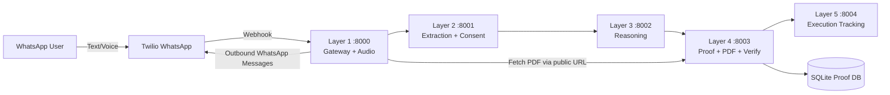

# Pactify

Pactify is a multi-layer contract intelligence and proof pipeline built with FastAPI, Docker Compose, and WhatsApp (Twilio).

It converts chat or voice notes into structured agreements, requires counterparty confirmation, generates proof with hash + PDF, and supports execution tracking.

## Highlights

- WhatsApp webhook ingestion (text and voice notes)
- Speech-to-text transcription (Whisper)
- Contract extraction and merge (LLM + rule fallback)
- Two-party confirmation flow with one-time code
- Reasoning + normalization pipeline
- Hash-based proof generation and PDF artifacts
- DB-backed proof storage (SQLite in Layer 4)
- Uploaded PDF verification against stored proof
- Execution and enforcement tracking (Layer 5)

## Architecture

The stack is split into independent services:

- Layer 1 (`:8000`): WhatsApp gateway, audio handling, TwiML responses, outbound notifications
- Layer 2 (`:8001`): contract extraction, session merge, consent/confirmation workflow
- Layer 3 (`:8002`): reasoning/orchestration, forwards to proof generation
- Layer 4 (`:8003`): proof hashing, PDF generation, proof verification APIs, SQLite proof store
- Layer 5 (`:8004`): execution lifecycle, reminders/disputes/reputation

### Architecture Diagram



## Repository Structure

```
.
├── docker-compose.yml
├── .env.example
├── layer1/
├── layer2/
├── layer3/
├── layer4/
├── layer5/
└── scripts/
```

## Prerequisites

- Docker Desktop
- Twilio account with WhatsApp sender (Sandbox or production sender)
- Public tunnel for webhook access (for example ngrok)
- Optional: LM Studio for local LLM extraction in Layer 2

## Quick Start

### 1. Configure environment

Create `.env` from `.env.example` and fill values.

Minimum required values:

- `TWILIO_ACCOUNT_SID`
- `TWILIO_AUTH_TOKEN`
- `TWILIO_WHATSAPP_FROM`
- `PUBLIC_BASE_URL` (your public HTTPS URL, for example ngrok)

Optional local LLM values:

- `OPENAI_BASE_URL` (for LM Studio, commonly `http://host.docker.internal:1234/v1`)
- `OPENAI_API_KEY`
- `OPENAI_MODEL`

### 2. Start all layers

```bash
docker compose up -d --build
```

### 3. Verify health

```bash
curl http://127.0.0.1:8000/webhook/whatsapp -I
curl http://127.0.0.1:8001/health
curl http://127.0.0.1:8002/health
curl http://127.0.0.1:8003/health
curl http://127.0.0.1:8004/health
```

### 4. Point Twilio webhook to Layer 1

Set Twilio WhatsApp webhook URL to:

`https://<your-public-domain>/webhook/whatsapp`

## End-to-End WhatsApp Flow

1. User sends agreement text or voice note to WhatsApp bot.
2. Layer 1 forwards content to Layer 2.
3. Layer 2 extracts contract and asks for missing fields if needed.
4. When complete, Layer 2 requests counterparty confirmation (`CONFIRM <CODE>`).
5. On confirmation, Layer 3 and Layer 4 generate proof (hash + PDF).
6. Final messages/PDF links are sent to both parties.
7. Layer 5 tracks contract status and reputation signals.

## Demo Scripts

### Demo A: Text Contract + Counterparty Confirmation

1. From initiator number, send:

```text
Naveed will lend Fahim 5000 rupees and he will return it in 3 days. Counterparty number is +91XXXXXXXXXX
```

2. Expected:
- Initiator gets confirmation instruction with a code.
- Counterparty gets auto-notification to send `CONFIRM <CODE>`.

3. From counterparty number, send:

```text
CONFIRM ABC123
```

4. Expected:
- Agreement is finalized.
- Both users receive final agreement message and PDF link/media.

### Demo B: Voice Note Flow

1. Send a voice note describing the agreement.
2. Expected immediate ACK:
- Voice note received, processing now.
3. Expected follow-up:
- Extracted contract response + next step/confirmation request.

### Demo C: Upload PDF Back for Verification

```bash
curl -X POST http://127.0.0.1:8003/verify-upload \
  -F "file=@/absolute/path/to/contract.pdf"
```

Expected response flags:
- `valid`
- `contract_hash_match`
- `exact_pdf_match`

## Core APIs

### Layer 1

- `POST /webhook/whatsapp`
- `GET /webhook/proof/{contract_id}.pdf`

### Layer 2

- `POST /process`
- `POST /confirm`
- `GET /health`

### Layer 3

- `POST /ingest`
- `GET /last`
- `GET /health`

### Layer 4

- `POST /generate-proof`
- `POST /proof/generate`
- `GET /proof-file/{contract_id}.pdf`
- `GET /verify/{contract_id}`
- `POST /verify-upload` (multipart file upload)
- `GET /health`

### Layer 5

- `POST /register_contract`
- `GET /status/{contract_id}`
- `POST /dispute`
- `GET /reputation/{phone}`
- `GET /health`

## API Request and Response Examples

### Layer 2: Process Contract

Request:

```json
POST /process
{
  "phone": "whatsapp:+919900001111",
  "text": "Naveed will lend Fahim 5000 rupees and return in 3 days. Counterparty number is +919900002222",
  "audio_path": "",
  "message_sid": "SM123"
}
```

Response (example):

```json
{
  "contract": {
    "type": "loan",
    "parties": [
      {"name": "Naveed", "role": "lender"},
      {"name": "Fahim", "role": "borrower"}
    ],
    "subject": "Naveed will lend Fahim 5000 rupees and return in 3 days",
    "consideration": "5000 INR",
    "terms": {
      "amount": {"value": 5000, "currency": "INR"},
      "timeline": "3 days",
      "conditions": []
    },
    "obligations": []
  },
  "missing_fields": [],
  "is_complete": false,
  "next_question": "Ask whatsapp:+919900002222 to send: CONFIRM Q1W2E3",
  "confirmation_required": true,
  "confirmation_status": "pending",
  "consent_code": "Q1W2E3",
  "counterparty_phone": "whatsapp:+919900002222"
}
```

### Layer 2: Confirm Contract

Request:

```json
POST /confirm
{
  "phone": "whatsapp:+919900002222",
  "code": "Q1W2E3",
  "message_sid": "SM124"
}
```

Response (example):

```json
{
  "status": "confirmed",
  "message": "Agreement confirmed by counterparty.",
  "contract": {"type": "loan"},
  "initiator_phone": "whatsapp:+919900001111",
  "confirmer_phone": "whatsapp:+919900002222"
}
```

### Layer 4: Generate Proof

Request:

```json
POST /generate-proof
{
  "layer2": {
    "status": "confirmed",
    "initiator_phone": "whatsapp:+919900001111",
    "confirmer_phone": "whatsapp:+919900002222",
    "contract": {
      "type": "loan",
      "subject": "Loan for 5000 INR",
      "terms": {"amount": {"value": 5000, "currency": "INR"}, "timeline": "3 days"}
    }
  }
}
```

Response (example):

```json
{
  "contract_id": "a0be57f70765",
  "hash": "...sha256...",
  "timestamp": "2026-03-29T12:00:00.000000",
  "pdf_path": "/tmp/layer4_proofs/a0be57f70765.pdf",
  "pdf_sha256": "...sha256..."
}
```

### Layer 4: Verify Uploaded PDF

Request:

```bash
curl -X POST http://127.0.0.1:8003/verify-upload \
  -F "file=@/absolute/path/to/contract.pdf"
```

Response (example):

```json
{
  "valid": true,
  "contract_hash_match": true,
  "exact_pdf_match": true,
  "contract_id": "a0be57f70765",
  "embedded_hash": "...",
  "db_hash": "...",
  "uploaded_pdf_sha256": "...",
  "db_pdf_sha256": "..."
}
```

## PDF Verification (Uploaded Document)

Layer 4 stores proof hash + PDF metadata in SQLite and supports uploaded verification.

### Verify by contract id

```bash
curl http://127.0.0.1:8003/verify/<contract_id>
```

### Verify uploaded PDF

```bash
curl -X POST http://127.0.0.1:8003/verify-upload \
  -F "file=@/absolute/path/to/contract.pdf"
```

Expected response fields include:

- `valid`
- `contract_hash_match`
- `exact_pdf_match`
- `contract_id`
- `embedded_hash`
- `db_hash`

Interpretation:

- `valid=true` and `contract_hash_match=true`: proof hash matches DB record
- `exact_pdf_match=true`: uploaded PDF is byte-for-byte identical
- `exact_pdf_match=false` with hash match: content proof matches, but file bytes differ

## Configuration Notes

- Layer 4 SQLite DB location can be changed with `LAYER4_DB_PATH`.
- Proof PDFs are saved under `LAYER4_PROOF_DIR` (default `/tmp/layer4_proofs`).
- `PUBLIC_BASE_URL` must be publicly reachable for WhatsApp media fetch.

## Troubleshooting

### WhatsApp audio shows "received" but no follow-up

Check Layer 1 logs:

```bash
docker compose logs --tail=200 layer1
```

Common causes:

- Twilio outbound rate/limit errors (`429`, error code `63038`)
- Wrong account SID/token loaded in container
- Sender mismatch between inbound and outbound account

### LLM extraction errors in Layer 2

If using LM Studio, ensure a model is loaded. Otherwise Layer 2 will log errors and fall back to rule-based extraction.

### PDF/media not delivered on WhatsApp

Ensure:

- `PUBLIC_BASE_URL` points to active tunnel/domain
- Twilio can reach `GET /webhook/proof/{contract_id}.pdf`

## Security

- Do not commit secrets. `.env` is gitignored.
- Rotate Twilio/OpenAI tokens if accidentally exposed.

## License

Add your preferred license in this repository (for example MIT, Apache-2.0, or proprietary).
